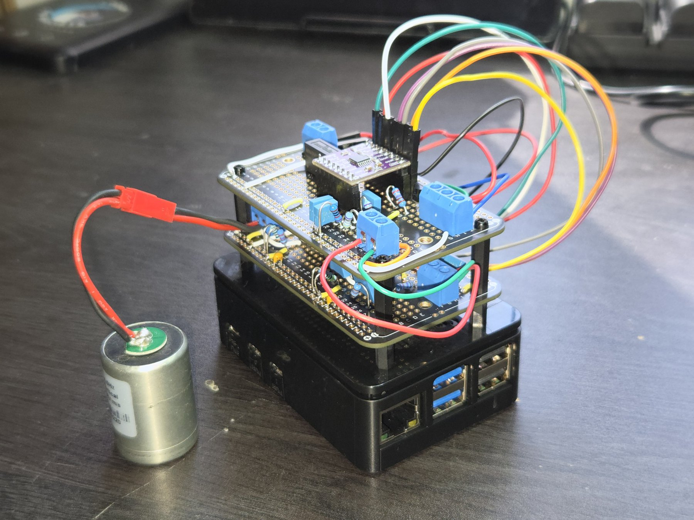
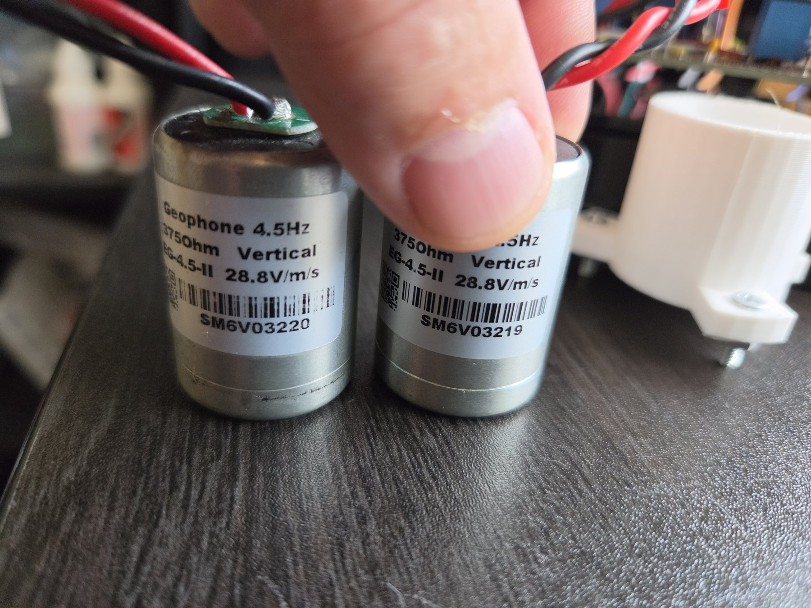

# DIY SEISMO

A home seismograph built from a $30 geophone, two hand-soldered boards and a
Raspberry Pi. The board flattens a 4.5 Hz EG-4.5-II geophone down to
**0.31 Hz** — low enough to see teleseisms — and a 24-bit ADS1220 on the Pi
logs it continuously in nm/s and streams it live to a PC.

| | |
|---|---|
| Sensor | EG-4.5-II vertical geophone, 4.5 Hz, 375 Ω, 28.8 V/(m/s) |
| Flat band | 0.31 – 40 Hz, ripple −0.49 / +0.00 dB from 1 to 40 Hz |
| Sensitivity | 1310 V/(m/s) at the board output; 433 V/(m/s) at the ADC |
| Full scale | ±1.18 mm/s, 0.141 nm/s per count |
| Noise floor (design) | 8.7 nm/s/√Hz at 1 Hz, 0.1 at 40 Hz |
| ADC | ADS1220, 24-bit, 330 SPS, logged at 165 SPS |
| Supply | 5 V from the Pi, 19 mA per rail |
| Output | miniSEED on the Pi's SD card, float32 stream over TCP |

## How it works

A geophone is a magnet on a spring inside a coil. Above its natural frequency
(4.5 Hz here) its output is proportional to ground velocity; below it the
output falls at 12 dB per octave. The **main board** puts two shelving stages
behind the coil that rise at exactly that rate from 4.5 Hz down to 0.31 Hz,
so the combination is flat, then a 60 Hz low-pass keeps the element's 140 Hz
spurious resonance out of the ADC. An **interface board** makes ±5 V from the
Pi's 5 V through an isolated converter, and lifts the ±signal onto a 1.67 V
pedestal so a single-supply ADC can read both halves of the swing. The Pi
notches mains, blocks DC, decimates and timestamps in software.

## Folders

| folder | what |
|---|---|
| [`hardware/`](hardware/) | **Start here.** [`eg45-board.html`](hardware/eg45-board.html) is the build document — schematics, board drawings, hole-by-hole placement, jumper tables, assembly stages, notes. [`README.md`](hardware/README.md) is the short version with the ordering list and every cold and powered test. Also the Pi-side ADS1220 driver and the DigiKey order as placed. |
| [`software/`](software/) | Capture daemon for the Pi (logs to disk and streams; systemd unit included), the live client and plotting tools for the PC, and the install steps. |
| `images/` | Photos. |

## Cost

Approximate, USD, 2026. Prices move; the DigiKey line is the order as actually
placed and includes five-packs of the resistors.

| Item | Where | Approx. |
|---|---|---|
| EG-4.5-II geophone, 4.5 Hz, 375 Ω | AliExpress / Alibaba | $30 |
| Raspberry Pi 4 or 5 (2–4 GB), power supply, 32 GB microSD, case | any Pi reseller | $75 |
| ADS1220 breakout module (CJMCU-1220, bare 16-pin) | AliExpress / Amazon | $10 |
| ElectroCookie solderable breadboards, 2 (sold in packs of 3) | Amazon | $10 |
| Board parts — op amps, film caps, 1 % and 0.1 % resistors, terminals, DC-DC converter, reference ([`hardware/digikey-order.csv`](hardware/digikey-order.csv)) | DigiKey | $79 |
| Cc, Rd1/Rd2, Cb1/Cb2 added 2026-09-16, 374 Ω test resistor | DigiKey | $4 |
| Header strips, Dupont wires, standoffs, twisted-pair lead to the geophone | drawer / Amazon | $8 |
| **Total** | | **≈ $215** |

The two op amps are the expensive line: AD797 ($26) and LT1113 ($13). Everything
else on the board is under two dollars a part. Already have a Pi? Then it is
about $140.

## Build order

1. Order the parts (`hardware/README.md`, *Ordering list*). Confirm the two
   op amps are in stock in DIP-8 before ordering anything else.
2. Build the main board, then the interface board, following the placement
   and jumper tables in `hardware/eg45-board.html`.
3. Run the cold resistance checks, then the powered checks in order
   (`hardware/README.md`, *Testing*). Op amps and the ADC module go in last.
4. Wire the Pi, run the driver by hand (`hardware/ads1220_capture.py`), tap the
   floor.
5. Install the capture service and the PC client (`software/README.md`).
6. Put the geophone on a solid floor, level, away from foot traffic. Wait a
   minute for the board to settle. Watch.
